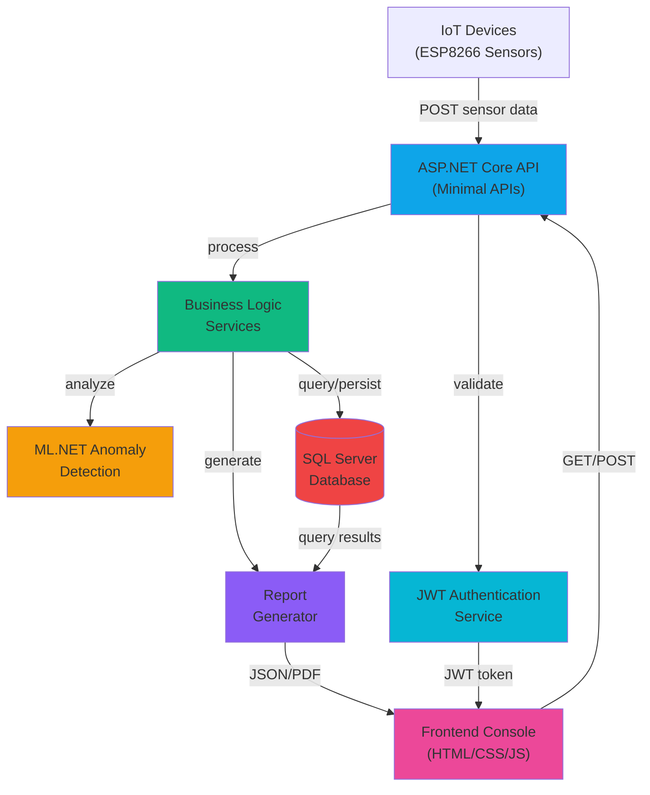
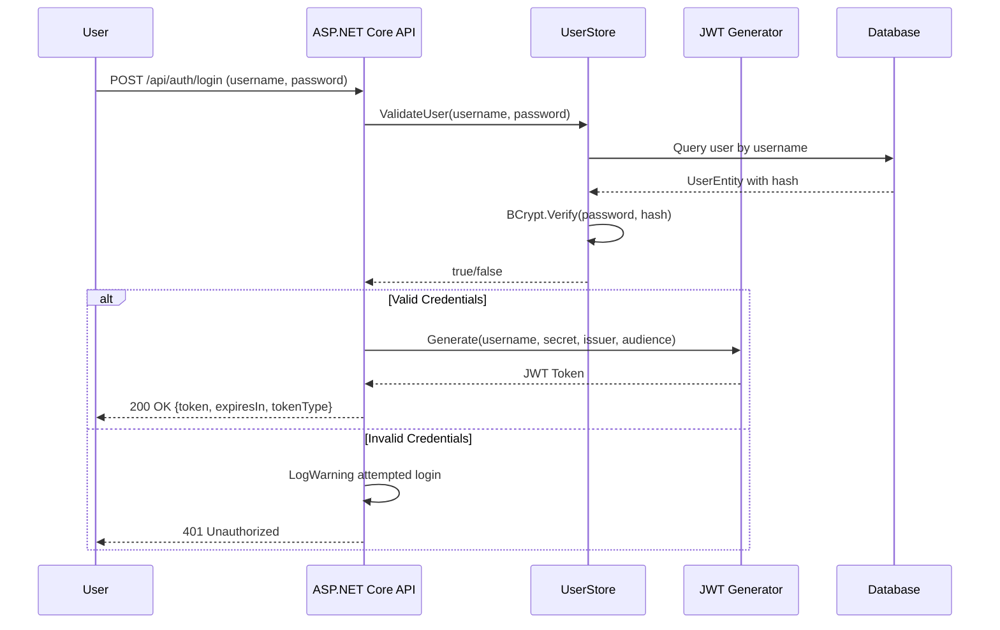
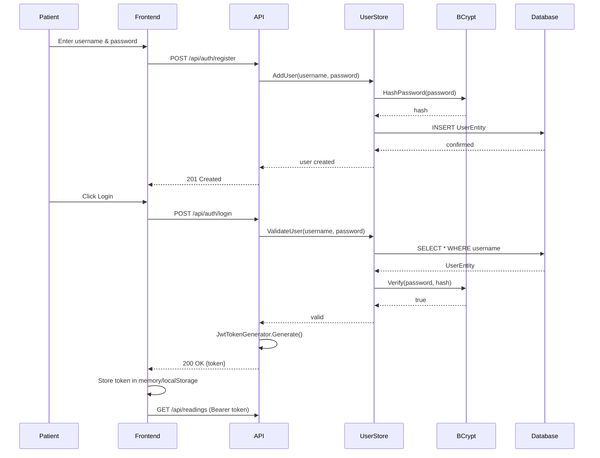
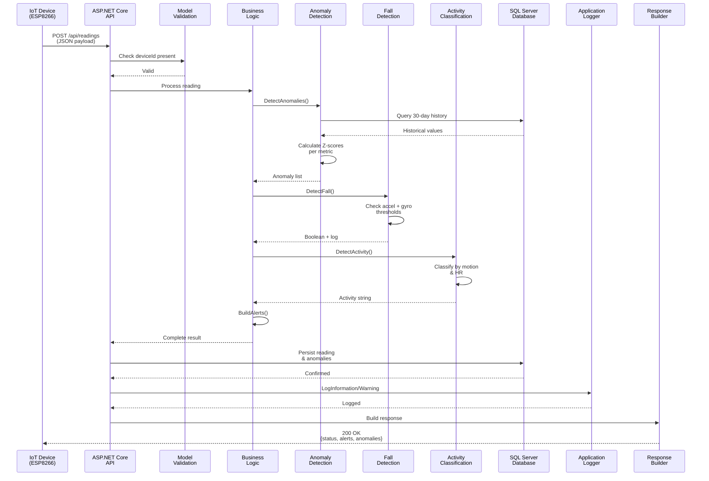
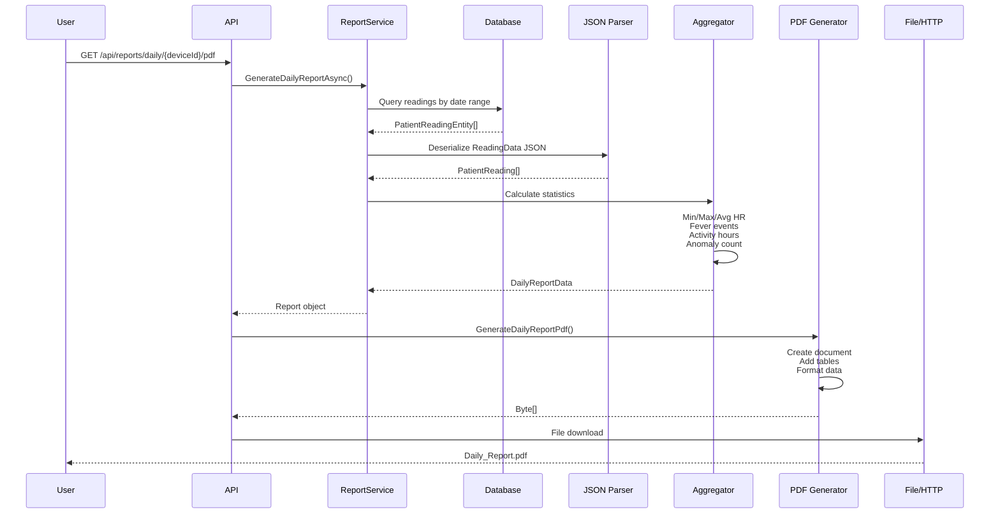
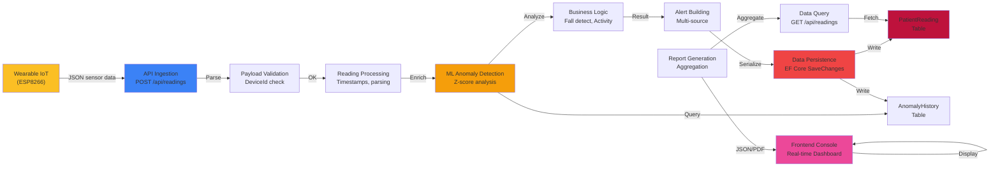

# AI-Powered Patient Healthcare Monitoring & Assistance System

ASP.NET Core Web API and full-stack application for real-time patient health monitoring, intelligent anomaly detection, and comprehensive health analytics using machine learning.

---

## Table of Contents

- [Project Overview](#project-overview)
- [Key Capabilities](#key-capabilities)
- [Why This Project Demonstrates .NET Engineering Skills](#why-this-project-demonstrates-net-engineering-skills)
- [System Architecture](#system-architecture)
- [Architecture & Design Decisions](#architecture--design-decisions)
- [Technology Stack](#technology-stack)
- [Backend Architecture](#backend-architecture)
- [AI & Machine Learning Integration](#ai--machine-learning-integration)
- [Database Design](#database-design)
- [Authentication & Security](#authentication--security)
- [API Design & Endpoints](#api-design--endpoints)
- [Project Structure](#project-structure)
- [Key Engineering Workflows](#key-engineering-workflows)
- [Data Flow Diagrams](#data-flow-diagrams)
- [Running the Project Locally](#running-the-project-locally)
- [Configuration & Environment Variables](#configuration--environment-variables)
- [Engineering Highlights](#engineering-highlights)
- [Skills Demonstrated](#skills-demonstrated)
- [Disclaimer](#disclaimer)

---

## Project Overview

The AI-Powered Patient Healthcare Monitoring & Assistance System is a comprehensive backend and frontend solution designed to collect, process, and analyze real-time biometric data from wearable IoT devices (ESP8266-based sensors). The system combines modern .NET backend architecture with intelligent machine learning for anomaly detection, enabling healthcare professionals and patients to monitor vital signs, detect anomalies, and receive actionable health insights.

### The Problem It Solves

Healthcare facilities and home care environments require continuous, real-time monitoring of patient vitals with minimal manual intervention. Traditional approaches are labor-intensive and lack predictive capabilities. This system automates sensor data collection, performs intelligent statistical analysis, detects health anomalies before they escalate, generates professional health reports, and provides immediate alerts for critical events like falls.

### Who It's Designed For

- **Healthcare Professionals**: Doctors and nurses monitoring patient cohorts
- **Home Care Providers**: Remote patient monitoring for elderly or chronic illness patients
- **Hospitals & Clinics**: Continuous observation and alerting infrastructure
- **Patients**: Self-monitoring with AI-assisted health insights

### How the Components Work Together

1. **IoT Devices** (ESP8266 sensors) → transmit biometric data (heart rate, temperature, motion, acceleration)
2. **ASP.NET Core API** → receives, validates, and processes incoming sensor readings
3. **Anomaly Detection Engine** (ML.NET) → analyzes data using statistical methods (Z-score analysis) and historical patterns
4. **Business Logic Services** → extract activity levels, detect falls, generate alerts
5. **Entity Framework Core** → persists data to SQL Server with optimized query patterns
6. **Reporting Engine** → generates professional PDF reports (daily, weekly, monthly aggregations)
7. **Frontend Console** → displays real-time monitoring dashboards and historical analytics
8. **JWT Authentication** → secures all API access with industry-standard token-based security

---

## Key Capabilities

### Patient Monitoring and Data Ingestion

- **Real-Time Sensor Data Collection**: Accepts multimodal biometric inputs from wearable IoT devices
  - Heart rate monitoring (BPM, raw IR values, heart rate validity)
  - Body temperature (Celsius/Fahrenheit conversion, fever detection)
  - Motion and acceleration data (3-axis accelerometer with magnitude calculations)
  - Gyroscopic data (rotational movement analysis)
  - Ambient environmental data (temperature, humidity)
  - Complete sensor health status tracking

- **Multi-Device Support**: Track multiple patient devices simultaneously with device ID isolation
- **High-Volume Data Handling**: Designed for continuous ingestion of sensor readings with intelligent data retention policies

### Anomaly Detection & Alerts

- **ML-Powered Anomaly Detection**: Uses ML.NET to implement statistical anomaly detection
  - Z-score based outlier detection with configurable sensitivity thresholds
  - 30-day rolling window analysis for metric-specific historical context
  - Per-metric anomaly tracking (heart rate, body temperature, acceleration, ambient temperature)
  - Automatic old record cleanup for storage efficiency

- **Smart Fall Detection**: Hybrid algorithm combining:
  - Accelerometer magnitude thresholds
  - Gyroscope rotational velocity analysis
  - Combined score calculation for high-confidence detection

- **Real-Time Alerts**: Immediate notification generation for:
  - Fever detection (high body temperature)
  - Fall events
  - Elevated heart rate conditions
  - Extreme ambient conditions (high temperature/humidity)
  - Sensor hardware failures (MPU, MAX30102, DS18B20, DHT11)
  - Wi-Fi signal strength degradation

### Activity Level Classification

- **Intelligent Activity Detection**: Classifies patient movement patterns into activity levels:
  - Sedentary (minimal motion, low acceleration)
  - Light activity (low to moderate acceleration and heart rate)
  - Moderate activity (medium acceleration and elevated heart rate)
  - Vigorous activity (high acceleration and elevated heart rate)

- **Supports Activity-Based Health Insights**: Enables correlation between activity and health metrics

### Health Reporting & Analytics

- **Multi-Timeframe Reports**:
  - Daily reports with hourly aggregations
  - Weekly reports with daily summaries
  - Monthly reports with comprehensive trend analysis
  - Alert history reports (configurable lookback period)
  - Anomaly reports with metric-specific breakdowns

- **PDF Report Generation**: Professional formatted PDF exports using iTextSharp
  - Automatic layout generation
  - Embedded charts and statistics
  - Timestamped and device-identified reports
  - Ready for clinical documentation

- **Statistical Aggregations**: 
  - Heart rate ranges (min, max, average)
  - Temperature statistics and fever events
  - Activity breakdown and duration
  - Anomaly frequency and patterns
  - Sensor reliability metrics

### Authentication & Authorization

- **User Management**: Registration and login system with secure password handling
  - BCrypt password hashing with automatic salt generation
  - Unique username enforcement
  - Account creation timestamps

- **JWT-Based API Security**: Industry-standard token authentication
  - Configurable token expiration (1-hour default)
  - Claim-based identity
  - Issuer and audience validation
  - HMAC-SHA256 signing

- **CORS Support**: Flexible cross-origin resource sharing for frontend integration

### System Status & Monitoring

- **Health Check Endpoint**: Real-time API status and stored reading count
- **Summary Endpoints**: Quick analytics on readings, anomalies, and activity patterns
- **Comprehensive Logging**: Structured logging of authentication, sensor processing, anomalies, and reports

---

## Why This Project Demonstrates .NET Engineering Skills

### ASP.NET Core & Web API Mastery

This project showcases **production-grade ASP.NET Core API design**:

- **Minimal APIs**: Modern, lightweight endpoint mapping without controller boilerplate (`.NET 6+` approach)
- **Dependency Injection**: Sophisticated service configuration using `IServiceProvider` patterns
  - Singleton services for ML models and data stores (avoiding redundant initialization)
  - Scoped database contexts for request isolation
  - Explicit service lifecycle management
- **Middleware Pipeline**: Custom middleware composition in extension methods for clean separation
- **Configuration Management**: Environment-based settings with JWT secrets, database connections, and custom issuer/audience claims
- **OpenAPI Support**: Built-in metadata for API documentation

### C# Language Features & LINQ

- **Advanced LINQ Queries**: Complex data aggregations and transformations
  - Multi-predicate filtering across multiple tables
  - GroupBy and Count operations for statistical summaries
  - OrderBy/ThenBy combinations for sorted data retrieval
  - Select projections for DTO transformation
- **Async/Await Patterns**: Asynchronous report generation and database queries for non-blocking I/O
- **LINQ-to-JSON**: Serialization/deserialization of complex nested data structures
- **Extension Methods**: Custom LINQ operators and fluent API extensions

### Entity Framework Core & Database Excellence

- **Fluent Mapping API**: Advanced configuration in `OnModelCreating`:
  - Entity key definitions and uniqueness constraints
  - Composite indexing (DeviceId + MetricType for anomaly lookups)
  - Temporal columns and standardized date handling
  - Property-level column type specifications

- **Query Optimization**: Strategic use of indexes for performance
  - Index on DeviceId for patient data isolation
  - Index on ReceivedAt for time-range queries
  - Composite indexes for multi-column lookups

- **Entity Relationships**: Proper normalization with referenced entities
- **Data Seeding & Migrations**: EF Core migrations for schema management
- **Repository Pattern**: `ReadingsStore` and `UserStore` abstract data access, enabling testability and persistence abstraction

### Architecture & Design Patterns

- **Clean Architecture Separation**: Clear responsibility boundaries
  - **Presentation Layer** (Endpoints): HTTP routing and response formatting
  - **Application/Service Layer** (Services): Business logic and orchestration
  - **Domain Layer** (Models): Core business entities and DTOs
  - **Data Layer** (Repository & DbContext): Persistence abstraction

- **SOLID Principles**:
  - **Single Responsibility**: Each service has one reason to change
  - **Open/Closed**: Extension through dependency injection rather than modification
  - **Liskov Substitution**: Services can be swapped via interfaces
  - **Interface Segregation**: IServiceProvider used selectively
  - **Dependency Inversion**: Dependencies injected, not created internally

- **Repository Pattern**: `ReadingsStore` implements data access abstraction
  - Enables unit testing with mock implementations
  - Centralizes query logic
  - Provides filtering, sorting, and pagination

- **Service Layer Abstraction**: 
  - `AnomalyDetectionService` encapsulates ML logic
  - `ReadingAnalysisService` handles synchronous health computations
  - `ReportService` abstracts complex report generation
  - `JwtTokenGenerator` follows utility pattern for security operations

### Authentication & Security Engineering

- **JWT Implementation**: Complete token-based security workflow
  - Secure key generation and validation
  - Standard claims (name, identifier) properly implemented
  - Configurable algorithm (HMAC-SHA256)
  - Expiration validation and time-based security

- **Password Security**: BCrypt hashing with proper salt handling
  - Defense against rainbow table attacks
  - Industry-standard security library

- **CORS Policy Configuration**: Thoughtful cross-origin resource sharing
- **Claims-Based Authorization**: Foundation for role-based access control

### Machine Learning Integration

- **ML.NET Framework**: Practical AI integration patterns
  - `MLContext` singleton for efficient model management
  - Statistical anomaly detection without pre-trained models
  - Feature engineering from raw biometric data

- **Anomaly Detection Algorithm**: Custom implementation combining:
  - Z-score calculation for outlier identification
  - Sliding window analysis with configurable sensitivity
  - Historical baseline establishment
  - Metric-specific analysis (heart rate vs. temperature requires different thresholds)

- **Data Pipeline**: Proper handling of ML data requirements
  - Queue-based window management
  - Proper null checking and edge case handling
  - Performance considerations for real-time processing

### Data Transformation & Serialization

- **DTOs (Data Transfer Objects)**: Structured `PatientReading` with nested objects
  - Separate domain concerns (database entities vs. API contracts)
  - JSON property naming conventions for API compatibility
  - Type safety across serialization boundaries

- **Complex Object Serialization**: 
  - Nested accelerometer, gyroscope, temperature, heart rate, ambient data
  - Proper null handling with `??` operators
  - JSON deserialization of stored aggregate data

### HTTP API Design

- **RESTful Convention**: Proper HTTP method usage (GET for retrieval, POST for creation)
- **Status Codes**: Correct response codes (201 Created, 400 Bad Request, 401 Unauthorized, 404 Not Found, 200 OK)
- **Request/Response Validation**: Input sanitization and error handling
- **JSON Content Negotiation**: Proper content-type handling and serialization

### Logging & Observability

- **Structured Logging**: Rich contextual information with log levels
  - `LogWarning` for alerts and anomalies
  - `LogInformation` for audit trails (authentication, reports)
  - `LogError` for exceptions with full exception context
  - Log message templates with parameters for efficient log aggregation

### Performance & Scalability Considerations

- **Connection Pooling**: EF Core connection management
- **Async Operations**: Non-blocking database queries and report generation
- **Efficient Queries**: Use of `.Take()` and `.Skip()` for data limiting
- **Data Retention Policy**: Automatic cleanup of old records (30-day history for anomalies, 100-reading limit per device)
- **Singleton Pattern for Expensive Resources**: ML models cached globally

---

## System Architecture



### Architecture Layers

**Presentation Layer** (`EndpointExtensions.cs`)
- HTTP endpoint definitions using minimal APIs
- Request validation and routing
- Response formatting and status code management

**Service Layer** (`Services/`)
- Business logic orchestration
- Cross-cutting concerns (authentication, reporting, analysis)
- Dependency resolution and service composition

**Domain Layer** (`Models/`)
- Core business entities (PatientReading, sensor data structures)
- Data transfer objects aligned with API contracts
- Validation models (RegisterRequest, LoginRequest)

**Data Layer** (`Data/`)
- Entity Framework Core DbContext configuration
- Entity-to-table mappings and relationships
- Index definitions for query performance
- Entity definitions (PatientReadingEntity, UserEntity, AnomalyHistoryEntity)

**AI/ML Layer** (`AI/Services/AnomalyDetectionService.cs`)
- Machine learning model instantiation and management
- Statistical analysis algorithms
- Feature extraction from raw sensor data

---

## Architecture & Design Decisions

### Why Minimal APIs?

The project uses **ASP.NET Core Minimal APIs** instead of traditional controllers. This decision reflects modern .NET development:
- Reduces boilerplate and routing overhead
- Improves startup time performance
- Provides explicit endpoint mapping for easier code navigation
- Aligns with microservice and serverless patterns
- Maintains full middleware and DI support

### Why Repository Pattern?

The `ReadingsStore` and `UserStore` classes implement the **Repository Pattern** to:
- Abstract database concerns from business logic
- Enable easy mocking for unit tests
- Provide a single point for query optimization
- Centralize data access logic (filtering, pagination, sorting)
- Support future persistence layer changes (swap SQL Server for CosmosDB, for example)

### Why Dependency Injection Singletons for ML Models?

The `MLContext` and `AnomalyDetectionService` are registered as **singletons** because:
- ML model initialization is expensive (CPU and memory)
- These objects are thread-safe and stateless
- Reusing the same instance across requests improves throughput
- Aligns with ML.NET best practices for production applications

### Why Asynchronous Report Generation?

`ReportService` methods use `async/await` for:
- Non-blocking database queries (especially important for large historical datasets)
- Responsive API behavior under concurrent requests
- Scalability without thread pool exhaustion
- Future support for external API calls (e.g., cloud storage for PDFs)

### Why Scoped DbContext?

`HealthMonitorDbContext` is registered as scoped to:
- Isolate database transactions per HTTP request
- Ensure proper entity state management
- Prevent connection pool exhaustion
- Support transactional consistency within a single request

### Why Store Complete Reading JSON?

The `PatientReadingEntity.ReadingData` field stores the complete JSON-serialized reading because:
- Preserves all sensor telemetry for forensic analysis
- Allows future schema extensions without database migrations
- Enables report generation even if the model definition changes
- Complies with healthcare audit requirements

### Why Composite Indexing?

The `AnomalyHistoryEntity` uses composite index on `(DeviceId, MetricType)` because:
- Queries filter by both columns frequently
- Dramatic query performance improvement (avoids table scans)
- Proper index selectivity for statistical analysis queries
- Common pattern in healthcare databases for patient-specific metrics

---

## Technology Stack

| Category           | Technology                                |
| ------------------ | ----------------------------------------- |
| Language           | C# 13                                     |
| Runtime            | .NET 10                                   |
| Backend Framework  | ASP.NET Core 10                           |
| API Pattern        | Minimal APIs                              |
| ORM                | Entity Framework Core 10                  |
| Database           | SQL Server (LocalDB in development)       |
| Authentication     | JWT Bearer + BCrypt                       |
| Machine Learning   | ML.NET 4.0                                |
| Report Generation  | iTextSharp 5.5.13 (PDF)                   |
| Data Export        | ClosedXML 0.102.1 (Excel)                 |
| Frontend           | HTML5 + CSS3 + JavaScript (Vanilla)       |
| Version Control    | Git / GitHub                              |

---

## Backend Architecture

### Dependency Injection & Service Configuration

The `ServiceCollectionExtensions.cs` configures the entire DI container using extension methods for clean, maintainable setup:

```csharp
// Authentication configuration with JWT validation
- Token validation parameters (issuer, audience, expiration)
- Claims-based identity

// Database configuration
- SQL Server connection via Entity Framework Core
- Connection string from appsettings.json

// Domain services
- ReadingsStore (singleton) - data access abstraction
- UserStore (singleton) - user persistence
- AnomalyDetectionService (singleton) - ML anomaly engine
- MLContext (singleton) - ML.NET model context
- ReportService (scoped) - report generation

// JSON serialization
- Case-insensitive property matching
- Null value exclusion in responses
```

### Request Processing Pipeline

A patient sensor reading follows this flow:

1. **HTTP POST** → `/api/readings` receives JSON payload with sensor data
2. **Model Validation** → Checks deviceId presence and payload structure
3. **Timestamp Assignment** → Adds server-side `ReceivedAt` timestamp
4. **Anomaly Detection** → Analyzes current reading against 30-day history using Z-score
5. **Fall Detection** → Evaluates accelerometer/gyroscope combination
6. **Activity Classification** → Determines activity level from motion and heart rate
7. **Alert Building** → Generates alert list from anomalies and sensor failures
8. **Data Persistence** → Stores reading to SQL Server via EF Core
9. **Logging** → Records all metrics and alerts to application logs
10. **Response** → Returns structured response with detection results

### Service Layer Components

**ReadingsStore**
- Manages patient reading persistence and retrieval
- Implements MaxReadings policy (100 readings per device)
- Provides device isolation and time-based queries
- Returns latest, all, or device-specific readings

**AnomalyDetectionService**
- Fetches historical data for each metric type
- Calculates Z-score for deviation detection
- Maintains rolling 20-reading window
- Automatically prunes records older than 30 days
- Returns list of detected anomalies per reading

**ReadingAnalysisService**
- Static utility for deterministic analysis
- Detects falls using threshold-based algorithms
- Classifies activity levels using motion and HR
- Aggregates all alerts (fever, falls, sensor failures, extreme conditions)

**ReportService**
- Generates daily, weekly, and monthly aggregations
- Parses stored JSON to reconstruct PatientReading objects
- Calculates statistical summaries (min/max/average/median)
- Builds alert and anomaly history reports
- Supports configurable time ranges

**UserStore**
- Manages user registration and authentication
- Stores BCrypt-hashed passwords
- Validates credentials during login
- Enforces unique usernames

**JwtTokenGenerator**
- Generates HMAC-SHA256 signed JWT tokens
- Includes username as both NameIdentifier and Name claims
- Sets 1-hour expiration
- Configurable issuer and audience

### Endpoint Mapping

All endpoints are defined in `EndpointExtensions.cs`:

**Authentication Endpoints**
```
POST   /api/auth/register      - Create new user
POST   /api/auth/login         - Authenticate and receive JWT token
```

**Reading Ingestion Endpoints**
```
POST   /api/readings           - Submit sensor reading
GET    /api/readings           - Get all recent readings
GET    /api/readings/latest    - Get most recent reading
GET    /api/readings/{deviceId} - Get readings for specific device
```

**Analytics & Summary Endpoints**
```
GET    /api/anomalies/summary   - Aggregated anomaly statistics
GET    /api/activity/summary    - Activity level breakdown
GET    /api/status              - API health and total stored readings
```

**Report Endpoints**
```
GET    /api/reports/daily/{deviceId}          - JSON daily report
GET    /api/reports/daily/{deviceId}/pdf      - PDF daily report
GET    /api/reports/weekly/{deviceId}         - JSON weekly report
GET    /api/reports/weekly/{deviceId}/pdf     - PDF weekly report
GET    /api/reports/monthly/{deviceId}        - JSON monthly report
GET    /api/reports/monthly/{deviceId}/pdf    - PDF monthly report
GET    /api/reports/alerts/{deviceId}         - Alert history (30-day default)
GET    /api/reports/alerts/{deviceId}/pdf     - PDF alert history
GET    /api/reports/anomalies/{deviceId}      - Anomaly report
GET    /api/reports/anomalies/{deviceId}/pdf  - PDF anomaly report
```

---

## AI & Machine Learning Integration

### Anomaly Detection Architecture

The system integrates **Microsoft ML.NET** for statistical anomaly detection. Unlike traditional ML workflows that require pre-training, this implementation uses online learning with Z-score analysis:

**Algorithm: Z-Score Based Outlier Detection**

For each metric (heart rate, temperature, acceleration, ambient temperature):

1. **Historical Window**: Fetch the 20 most recent readings for the device/metric combination
2. **Statistical Calculation**:
   ```
   Mean = average of historical values
   StdDev = standard deviation of historical values
   Z-Score = |CurrentValue - Mean| / (StdDev + epsilon)
   IsAnomaly = Z-Score > SensitivityThreshold (2.0)
   ```
3. **Sensitivity**: Z-score threshold of 2.0 flags values ≥2 standard deviations from mean (5% typical range of normal distribution)
4. **Metric-Specific Context**: Each metric maintains its own history, enabling heart rate anomalies independent from temperature anomalies

**Why This Approach?**

- **No Training Required**: Operates on live data immediately, perfect for real-time monitoring
- **Adaptive Baselines**: Automatically adjusts to patient's normal range as data accumulates
- **Computationally Efficient**: Z-score calculation is O(n) with small window
- **Interpretable**: Unlike neural networks, statistical anomalies are explainable
- **Robust Multi-Metric**: Different sensors have different scales, Z-score normalizes comparisons

### Fall Detection Algorithm

Combines multimodal sensor data for high-confidence fall detection:

```
AccelMagnitude = √(x² + y² + z²)
GyroMagnitude = √(x² + y² + z²)

if AccelMagnitude > 2.0 AND GyroMagnitude > 200:
	CombinedScore = (AccelMagnitude / 2.0) + (GyroMagnitude / 200)
	if CombinedScore > 2.5:
		FALL_DETECTED = true
```

**Design Rationale**:
- **Accelerometer Threshold (2.0 g)**: Typical fall generates 2-3g acceleration
- **Gyroscope Threshold (200 dps)**: User rotation during fall
- **Combined Score**: Ensures both axes activate (not just dropping device)
- **Hysteresis**: Both thresholds must trigger simultaneously to reduce false positives

### Activity Classification

Categorizes patient movement into health-relevant activity levels:

```
If no motion AND accel < 0.3:  Sedentary
Else if accel < 0.8 OR HR < 80: Light
Else if accel < 1.5 OR HR < 110: Moderate
Else: Vigorous
```

**Integration Points**:
- Input: Accelerometer magnitude, heart rate BPM, motion detection flag
- Output: Activity level string for downstream reporting
- Healthcare Value: Correlates activity with heart rate for holistic health picture

### ML Model Lifecycle

The `MLContext` singleton is instantiated once during application startup:

```csharp
services.AddSingleton(sp => new MLContext());
```

**Advantages**:
- Amortizes initialization cost across all requests
- Thread-safe for concurrent anomaly detections
- Memory efficient for long-running services
- Enables efficient caching of training data if future models are added

---

## Database Design

### Schema Overview

**HealthMonitorDbContext** manages three interconnected entity types:

#### PatientReadingEntity
Primary entity for sensor data storage.

| Column          | Type      | Purpose                                    |
| --------------- | --------- | ------------------------------------------ |
| Id              | int       | Primary key (auto-increment)               |
| DeviceId        | string    | Foreign reference to wearable device       |
| Timestamp       | long      | Unix timestamp from device                 |
| ReceivedAt      | datetime2 | Server-side arrival timestamp              |
| ActivityLevel   | string    | Classification (Sedentary/Light/Moderate/Vigorous) |
| DetectedAnomalies | string  | JSON array of anomaly strings              |
| ReadingData     | string    | Complete JSON serialization of reading     |

**Indexes**:
- Clustered index on `Id`
- Non-clustered index on `DeviceId` (device isolation queries)
- Non-clustered index on `ReceivedAt` (time-range aggregations)

**Design Decision**: Storing both `DetectedAnomalies` and `ReadingData` as JSON strings provides flexibility—anomalies can be queried without deserialization, while complete data preserves audit trail.

#### UserEntity
Stores authentication credentials.

| Column      | Type     | Purpose                        |
| ----------- | -------- | ------------------------------ |
| Id          | int      | Primary key                    |
| Username    | string   | Unique user identifier         |
| PasswordHash | string  | BCrypt hashed password         |
| CreatedAt   | datetime | Account creation timestamp     |

**Indexes**:
- Unique index on `Username` (enforces uniqueness, enables fast lookups)

#### AnomalyHistoryEntity
Maintains metric-specific history for Z-score calculations.

| Column      | Type     | Purpose                                  |
| ----------- | -------- | ---------------------------------------- |
| Id          | int      | Primary key                              |
| DeviceId    | string   | Device reference                         |
| MetricType  | string   | Type (HeartRate/Temperature/Acceleration/AmbientTemp) |
| Value       | float    | Metric value                             |
| RecordedAt  | datetime | Timestamp of measurement                 |

**Indexes**:
- Composite index on `(DeviceId, MetricType)` - optimizes sliding window queries
- Index on `RecordedAt` - supports history pruning queries

**Design Decision**: Separate table enables efficient historical queries without scanning complete reading payloads. Per-metric history allows independent Z-score calculations.

### Data Flow: Persistence

1. **Ingestion**: PatientReading DTO arrives at API
2. **Validation**: Ensure DeviceId presence
3. **Serialization**: Convert to JSON strings for storage
4. **Persistence**: Create PatientReadingEntity and AnomalyHistoryEntity records
5. **Cleanup**: Remove readings exceeding MaxReadings policy (100 per device)
6. **Auto-Pruning**: Delete anomaly history older than 30 days
7. **Consistency**: Single SaveChanges() call per request (transaction boundary)

### EF Core Configuration

**Model Building** (`OnModelCreating`):
- Explicit key configuration (`HasKey`)
- Required vs. optional properties (nullability)
- Column-specific type specifications ("datetime2" for precision)
- Unique constraint enforcement
- Index creation and composition

**Query Patterns**:
- Async queries for non-blocking database access
- LINQ projections to minimize data transfer
- Take() and Skip() for result limiting
- OrderBy/OrderByDescending for sorted retrieval
- Where() predicates for efficient filtering

---

## Authentication & Security

### JWT Authentication Flow



### Token Structure

Generated JWT contains:

**Header**
```json
{
  "alg": "HS256",
  "typ": "JWT"
}
```

**Payload** (Claims)
```json
{
  "nameid": "username",
  "name": "username",
  "aud": "PatientMonitorClient",
  "iss": "PatientMonitorAPI",
  "exp": 1735689600
}
```

**Signature**
```
HMACSHA256(header + payload, secret)
```

### Token Validation

All protected endpoints validate incoming tokens:

```csharp
TokenValidationParameters:
  - ValidateIssuerSigningKey = true (verify signature)
  - IssuerSigningKey = symmetric key from config
  - ValidateIssuer = true (issuer must match config)
  - ValidateAudience = true (audience must match config)
  - ValidateLifetime = true (check expiration)
```

### Password Security

User passwords are hashed using **BCrypt**:

```csharp
// During registration:
string hash = BCrypt.HashPassword(password);

// During login:
bool valid = BCrypt.Verify(password, storedHash);
```

**BCrypt Properties**:
- Automatic salt generation (16 random bytes per password)
- Configurable work factor (computational cost increases over time)
- Resistant to rainbow table attacks
- Industry standard for healthcare data

### CORS Configuration

The API enables cross-origin requests for frontend integration:

```csharp
AllowAll policy:
  - AllowAnyOrigin() - any domain can request
  - AllowAnyMethod() - GET, POST, etc. all permitted
  - AllowAnyHeader() - any request headers accepted
```

**Production Note**: This permissive configuration is suitable for MVP/development. Production deployment should restrict CORS to known frontend domain(s).

### Security Layers Summary

| Layer            | Implementation                            |
| ---------------- | ----------------------------------------- |
| Authentication   | JWT Bearer tokens with configurable claims |
| Authorization    | Claims-based (foundation for role-based)   |
| Password Storage | BCrypt with automatic salting              |
| Secret Management | Configuration-based (appsettings.json)     |
| Transport        | HTTPS capable (appsettings support)        |
| Input Validation | Null/whitespace checks on auth fields      |
| Logging          | Failed login attempts logged as warnings   |

---

## API Design & Endpoints

### Design Principles

The API follows **REST conventions** and **ASP.NET Core best practices**:

1. **Consistent Naming**: `/api/{resource}/{action}` patterns
2. **Proper HTTP Methods**: GET for read, POST for create
3. **Standard Status Codes**: 200 (OK), 201 (Created), 400 (Bad Request), 401 (Unauthorized), 404 (Not Found)
4. **JSON Serialization**: Camel-case property naming by convention
5. **Error Responses**: Structured error payloads with messages

### Endpoint Categories

#### Authentication Endpoints

**POST /api/auth/register**

Request:
```json
{
  "username": "patient001",
  "password": "SecurePassword123!"
}
```

Response (201 Created):
```json
{
  "username": "patient001"
}
```

Validation:
- Username and password required
- User must not already exist
- Returns 400 if user exists

**POST /api/auth/login**

Request:
```json
{
  "username": "patient001",
  "password": "SecurePassword123!"
}
```

Response (200 OK):
```json
{
  "token": "eyJhbGciOiJIUzI1NiIsInR5cCI6IkpXVCJ9...",
  "expiresIn": 3600,
  "tokenType": "Bearer"
}
```

Response (401 Unauthorized):
```json
{ }
```

#### Reading Ingestion

**POST /api/readings**

Receives sensor data from IoT device.

Request (Example):
```json
{
  "deviceId": "esp8266-001",
  "timestamp": 1735610400000,
  "accelerometer": {
	"x": 0.1,
	"y": 0.2,
	"z": 0.95,
	"magnitude": 1.0,
	"fallDetected": false
  },
  "gyroscope": {
	"x": 5.0,
	"y": 3.0,
	"z": 2.0
  },
  "temperature": {
	"celsius": 36.8,
	"fahrenheit": 98.24,
	"sensorOk": true,
	"fever": false
  },
  "heartRate": {
	"bpm": 72.5,
	"avgBpm": 70,
	"fingerDetected": true,
	"irRaw": 85000,
	"highRate": false
  },
  "motionDetected": true,
  "ambient": {
	"tempCelsius": 22.5,
	"humidity": 45.0,
	"sensorOk": true
  },
  "sensorStatus": {
	"mpuOk": true,
	"maxOk": true,
	"ds18Ok": true,
	"dhtOk": true,
	"wifiRssi": -55
  }
}
```

Response (200 OK):
```json
{
  "status": "received",
  "alerts": ["HIGH_HEART_RATE"],
  "anomalies": ["ANOMALY_HEART_RATE"],
  "activityLevel": "Light",
  "stored": 47,
  "serverTime": "2024-12-31T10:30:45.1234567Z"
}
```

Processing:
- Validates deviceId presence
- Performs anomaly detection via ML
- Detects falls algorithmically
- Classifies activity level
- Generates alerts
- Persists to database
- Logs all metrics

**GET /api/readings**

Returns recent readings (limited to 100).

Response (200 OK):
```json
[
  {
	"id": 1,
	"deviceId": "esp8266-001",
	"timestamp": 1735610400000,
	"receivedAt": "2024-12-31T10:30:45Z",
	"activityLevel": "Light",
	"detectedAnomalies": "[\"ANOMALY_HEART_RATE\"]",
	"readingData": "{...complete JSON...}"
  }
]
```

**GET /api/readings/latest**

Returns most recent single reading.

Response (200 OK):
```json
{ /* PatientReadingEntity */ }
```

Response (404 Not Found):
```json
{
  "error": "No readings yet"
}
```

**GET /api/readings/{deviceId}**

Returns readings for specific device (limited to 100).

Response (200 OK):
```json
[
  { /* PatientReadingEntity */ }
]
```

#### Analytics & Summaries

**GET /api/anomalies/summary**

Aggregated anomaly statistics across all devices.

Response (200 OK):
```json
{
  "totalReadings": 347,
  "readingsWithAnomalies": 23,
  "commonAnomalies": [
	{
	  "anomaly": "ANOMALY_HEART_RATE",
	  "count": 12
	},
	{
	  "anomaly": "ANOMALY_BODY_TEMP",
	  "count": 8
	}
  ]
}
```

**GET /api/activity/summary**

Activity level breakdown and recent activity timeline.

Response (200 OK):
```json
{
  "totalReadings": 347,
  "activityBreakdown": {
	"sedentary": 145,
	"light": 152,
	"moderate": 38,
	"vigorous": 12
  },
  "recentActivity": [
	{
	  "time": "2024-12-31T10:30:45Z",
	  "activity": "Light"
	}
  ]
}
```

**GET /api/status**

System health check.

Response (200 OK):
```json
{
  "status": "online",
  "totalStored": 347,
  "serverTime": "2024-12-31T10:35:20Z"
}
```

#### Reporting Endpoints

All report endpoints generate comprehensive health summaries:

**GET /api/reports/daily/{deviceId}**

JSON daily report with hourly aggregations.

Response includes:
- Device ID and report date
- Total readings for the day
- Heart rate statistics (min, max, average)
- Temperature data and fever occurrences
- Activity breakdown by hour
- Anomalies and alerts
- Sensor reliability metrics

**GET /api/reports/daily/{deviceId}/pdf**

Returns binary PDF file with professional formatting.

File download: `Daily_Report_{deviceId}_{date}.pdf`

**GET /api/reports/weekly/{deviceId}**

Weekly aggregation with daily summaries and trends.

**GET /api/reports/weekly/{deviceId}/pdf**

File download: `Weekly_Report_{deviceId}_{start}.pdf`

**GET /api/reports/monthly/{deviceId}**

Monthly comprehensive analysis with week-by-week metrics.

**GET /api/reports/monthly/{deviceId}/pdf**

File download: `Monthly_Report_{deviceId}_{year}-{month}.pdf`

**GET /api/reports/alerts/{deviceId}?daysBack=30**

Alert history report (default 30 days, customizable).

Response includes:
- Chronological alert list
- Alert type frequency
- Correlation with activity and vitals

**GET /api/reports/alerts/{deviceId}/pdf**

File download: `Alert_History_{deviceId}_{date}.pdf`

**GET /api/reports/anomalies/{deviceId}?daysBack=30**

Anomaly-specific analysis with metric breakdown.

Response includes:
- Anomaly frequency per metric
- Time-series anomaly occurrences
- Statistical summary of anomalous values

**GET /api/reports/anomalies/{deviceId}/pdf**

File download: `Anomaly_Report_{deviceId}_{date}.pdf`

---

## Project Structure

```
Ai healthcare monitoring and assistance system/
│
├── Ai healthcare monitoring and assistance system Backend/
│   ├── AI/
│   │   └── Services/
│   │       └── AnomalyDetectionService.cs          (ML.NET anomaly detection)
│   │
│   ├── Data/
│   │   ├── HealthMonitorDbContext.cs               (EF Core DbContext + entity definitions)
│   │   └── DatabaseSeeder.cs                       (Initial data setup)
│   │
│   ├── Extensions/
│   │   ├── ApplicationExtensions.cs                (Middleware configuration)
│   │   ├── EndpointExtensions.cs                   (Minimal API endpoint mapping)
│   │   └── ServiceCollectionExtensions.cs          (Dependency injection setup)
│   │
│   ├── Models/
│   │   ├── PatientReading.cs                       (DTOs: RegisterRequest, LoginRequest, PatientReading, sensor data)
│   │   └── ReportModels.cs                         (Report DTOs: DailyReportData, etc.)
│   │
│   ├── Services/
│   │   ├── ReadingAnalysisService.cs               (Fall detection, activity classification)
│   │   ├── ReadingLogger.cs                        (Structured logging)
│   │   ├── ReadingsStore.cs                        (Repository pattern for readings)
│   │   ├── UserStore.cs                            (User persistence and authentication)
│   │   ├── JwtTokenGenerator.cs                    (JWT token creation)
│   │   ├── ReportService.cs                        (Daily/weekly/monthly report generation)
│   │   └── PdfReportGenerator.cs                   (iTextSharp PDF formatting)
│   │
│   ├── Properties/
│   │   └── launchSettings.json                     (Development server configuration)
│   │
│   ├── Migrations/                                 (EF Core database migrations)
│   │
│   ├── Program.cs                                  (Application entry point)
│   ├── appsettings.json                            (Configuration: DB, JWT, logging)
│   ├── appsettings.Development.json                (Development-specific overrides)
│   ├── Ai healthcare monitoring and assistance system.csproj   (Project file)
│   └── Ai healthcare monitoring and assistance system.http     (REST client test file)
│
├── ai patient healthcare and monitoring frontend/
│   └── index.html                                  (Single-page application UI)
│
├── Ai healthcare monitoring and assistance system.slnx  (Solution file)
│
├── API_DOCUMENTATION.md                            (API reference)
├── SAMPLE_READINGS.md                              (Example sensor payloads)
├── README.md                                       (This file)
│
└── .git/                                           (Git repository)
```

### Key Architectural Files

**Program.cs**
- Application bootstrap process
- Calls extension methods for service registration and middleware setup

**appsettings.json**
- Connection string (SQL Server LocalDB)
- JWT configuration (secret, issuer, audience)
- Logging levels

**EndpointExtensions.cs**
- 106 lines mapping all API routes
- Inline dependency injection for each endpoint
- Complete business logic orchestration

**AnomalyDetectionService.cs**
- ML.NET integration
- Per-metric Z-score calculation
- Historical data aggregation and cleanup

**ReportService.cs**
- 651 lines of report generation logic
- Time-range filtered queries
- Statistical aggregation (min/max/avg/median)
- Activity and anomaly pattern analysis

---

## Key Engineering Workflows

### Workflow 1: Patient Registration & Authentication



### Workflow 2: Real-Time Sensor Data Ingestion & Analysis



### Workflow 3: Report Generation Pipeline



---

## Data Flow Diagrams

### Complete System Data Flow



---

## Running the Project Locally

### Prerequisites

- **.NET SDK 10.0** or later (download from https://dotnet.microsoft.com/download)
- **SQL Server Express or LocalDB** (included with Visual Studio Community)
- **Visual Studio 2022** or later (Community Edition sufficient)
- **Git** for repository management

### Clone the Repository

```powershell
git clone https://github.com/ammarhisham97-rgb/Ai-Patient-healthcare-monitoring-and-assitance-.git
cd "Ai healthcare monitoring and assistance system"
```

### Database Setup

The project uses Entity Framework Core with SQL Server LocalDB.

**Option 1: Using Visual Studio Package Manager Console**

1. Open Package Manager Console: Tools > NuGet Package Manager > Package Manager Console
2. Set default project to "Ai healthcare monitoring and assistance system Backend"
3. Run migration:
   ```powershell
   Update-Database
   ```

**Option 2: Using .NET CLI**

```powershell
cd "Ai healthcare monitoring and assistance system Backend"
dotnet ef database update
```

This will:
- Create the `Healthcaremonitoringandassistance` database
- Create tables: `PatientReadings`, `Users`, `AnomalyHistory`
- Create indexes on DeviceId, ReceivedAt, and composite keys

### Configure Application Settings

Edit `Ai healthcare monitoring and assistance system Backend\appsettings.json`:

```json
{
  "ConnectionStrings": {
	"DefaultConnection": "Data Source=(localdb)\\MSSQLLocalDB;Initial Catalog=Healthcaremonitoringandassistance;Integrated Security=True;"
  },
  "JwtSecret": "YourSuperSecretKeyForJWTAuthenticationMinimum32Characters!!!",
  "JwtIssuer": "PatientMonitorAPI",
  "JwtAudience": "PatientMonitorClient",
  "Logging": {
	"LogLevel": {
	  "Default": "Information",
	  "Microsoft.AspNetCore": "Warning"
	}
  },
  "AllowedHosts": "*"
}
```

**Security Notes**:
- Change `JwtSecret` to a cryptographically secure random string (minimum 32 characters)
- Never commit secrets to version control
- Use User Secrets or environment variables in production

### Run the Backend

**Using Visual Studio**

1. Set startup project to "Ai healthcare monitoring and assistance system Backend"
2. Press F5 or click Run
3. API will start on `https://localhost:5011` (HTTPS) or `http://localhost:5010` (HTTP)

**Using .NET CLI**

```powershell
cd "Ai healthcare monitoring and assistance system Backend"
dotnet run
```

Expected output:
```
info: Microsoft.Hosting.Lifetime[14]
  Now listening on: http://localhost:5010
info: Microsoft.Hosting.Lifetime[14]
  Now listening on: https://localhost:5011
```

### Access the Frontend

Open the frontend HTML in your browser:

```
File > Open File > ai patient healthcare and monitoring frontend\index.html
```

Or serve via a simple HTTP server:

```powershell
cd "ai patient healthcare and monitoring frontend"
python -m http.server 8000
# Access: http://localhost:8000
```

### Test the API

Use the provided `.http` file in Visual Studio:

**Ai healthcare monitoring and assistance system Backend\Ai healthcare monitoring and assistance system.http**

Sample requests:

```http
### Register
POST http://localhost:5010/api/auth/register
Content-Type: application/json

{
  "username": "patient001",
  "password": "SecurePassword123!"
}

### Login
POST http://localhost:5010/api/auth/login
Content-Type: application/json

{
  "username": "patient001",
  "password": "SecurePassword123!"
}

### Submit Reading
POST http://localhost:5010/api/readings
Content-Type: application/json

{
  "deviceId": "esp8266-001",
  "timestamp": 1735610400000,
  "accelerometer": {"x": 0.1, "y": 0.2, "z": 0.95, "magnitude": 1.0, "fallDetected": false},
  "gyroscope": {"x": 5.0, "y": 3.0, "z": 2.0},
  "temperature": {"celsius": 36.8, "fahrenheit": 98.24, "sensorOk": true, "fever": false},
  "heartRate": {"bpm": 72.5, "avgBpm": 70, "fingerDetected": true, "irRaw": 85000, "highRate": false},
  "motionDetected": true,
  "ambient": {"tempCelsius": 22.5, "humidity": 45.0, "sensorOk": true},
  "sensorStatus": {"mpuOk": true, "maxOk": true, "ds18Ok": true, "dhtOk": true, "wifiRssi": -55}
}

### Get Status
GET http://localhost:5010/api/status

### Generate Daily Report
GET http://localhost:5010/api/reports/daily/esp8266-001
```

---

## Configuration & Environment Variables

### appsettings.json Reference

| Variable                       | Type    | Default Value                                           | Purpose                            |
| ------------------------------ | ------- | ------------------------------------------------------- | ---------------------------------- |
| `ConnectionStrings:DefaultConnection` | string  | `Data Source=(localdb)\MSSQLLocalDB;Initial Catalog=Healthcaremonitoringandassistance;Integrated Security=True;` | SQL Server connection string       |
| `JwtSecret`                    | string  | `YourSuperSecretKeyForJWTAuthenticationMinimum32Characters!!!` | Secret key for JWT signing         |
| `JwtIssuer`                    | string  | `PatientMonitorAPI`                                     | Token issuer claim value           |
| `JwtAudience`                  | string  | `PatientMonitorClient`                                  | Token audience claim value         |
| `Logging:LogLevel:Default`     | string  | `Information`                                            | Default log level                  |
| `Logging:LogLevel:Microsoft.AspNetCore` | string  | `Warning`                                               | ASP.NET Core framework log level   |
| `AllowedHosts`                 | string  | `*`                                                     | CORS allowed hosts                 |

### Production Deployment Checklist

- [ ] Use environment variables or Azure Key Vault for sensitive configuration
- [ ] Set `JwtSecret` to cryptographically secure random string (minimum 32 characters)
- [ ] Change `AllowedHosts` to specific domain(s)
- [ ] Update CORS policy to restrict to known frontend origin
- [ ] Configure SQL Server production instance (not LocalDB)
- [ ] Enable HTTPS with valid SSL certificate
- [ ] Set logging level to `Warning` or `Error` in production
- [ ] Implement request rate limiting
- [ ] Enable database backup strategy
- [ ] Configure monitoring and alerting

---

## Engineering Highlights

This project demonstrates production-grade software engineering practices across multiple domains:

### Backend Architecture Excellence
- **Clean layering** with clear responsibilities (Presentation → Application → Domain → Data)
- **Dependency Injection** with thoughtful lifecycle management (Singleton for ML, Scoped for DbContext)
- **Repository Pattern** enabling testing and persistence abstraction
- **Middleware composition** in extension methods for maintainability

### Real-Time Data Processing
- **Async/await** for non-blocking I/O at scale
- **Streaming pattern** for continuous sensor ingestion
- **Efficient memory management** with rolling windows and automatic data cleanup
- **Concurrent request handling** with proper transaction boundaries

### Machine Learning Integration
- **Statistical anomaly detection** without requiring training datasets
- **Adaptive baselines** that adjust to patient-specific patterns
- **Multi-metric analysis** with metric-specific thresholds
- **Production-grade ML.NET** singleton pattern for model reuse

### Database Design
- **Normalized schema** with appropriate entity separation
- **Strategic indexing** on frequently-queried columns
- **JSON serialization** for audit trail preservation and schema flexibility
- **Automatic data lifecycle** with retention policies (30-day history)

### Security Implementation
- **JWT authentication** with standard claims and validation
- **BCrypt password hashing** with automatic salts
- **CORS policies** for safe cross-origin access
- **Input validation** and error handling

### Real-World Healthcare Patterns
- **Device isolation** ensuring patient data privacy
- **Time-series data** with efficient historical queries
- **Alert generation** from multiple rule sets
- **Professional reporting** in PDF format for clinical documentation
- **Sensor health monitoring** for device reliability

### Code Quality
- **Consistent naming conventions** following .NET standards
- **Rich logging** enabling troubleshooting and audit trails
- **Null safety** with C# nullable reference types
- **Static analysis ready** (no compiler warnings/errors)
- **Comprehensive DTOs** separating API contracts from database models

---

## Skills Demonstrated

### Backend Development

**Languages & Frameworks**
- C# 13 (modern language features, nullable reference types, LINQ)
- .NET 10 (latest runtime)
- ASP.NET Core 10 (minimal APIs, dependency injection, middleware)

**Database & ORM**
- Entity Framework Core 10 (migrations, LINQ, relationships, indexes)
- SQL Server (LocalDB for development, production-ready)
- LINQ-to-SQL (complex queries, aggregations)

**API Design**
- REST conventions (HTTP methods, status codes)
- JSON serialization (DTOs, nested objects)
- Error handling (structured responses)
- Authentication (JWT Bearer)

**Architecture & Patterns**
- Clean Architecture (layered separation)
- SOLID Principles (single responsibility, dependency inversion)
- Repository Pattern (data access abstraction)
- Service Layer Pattern (business logic)

### Machine Learning & Data Science

- ML.NET framework integration
- Statistical analysis (mean, standard deviation, Z-scores)
- Anomaly detection algorithms
- Time-series data handling
- Sliding window analysis

### Security Engineering

- JWT token generation and validation
- Password hashing (BCrypt)
- Claims-based authorization
- Cryptographic signing (HMAC-SHA256)
- Secure configuration management

### Data Engineering

- Database design (schema, relationships, constraints)
- Query optimization (indexes, execution plans)
- Time-series data modeling
- Data retention policies
- Historical analytics

### Frontend Integration

- RESTful API consumption
- CORS configuration
- Authentication token management
- Real-time data display
- PDF report viewing

### DevOps & Deployment

- Git version control
- .NET CLI tooling
- Configuration management (appsettings.json)
- Environment-specific settings
- Local development setup
- SQL Server database management

### Software Engineering Practices

- Structured logging (SeriLog ready)
- Error handling and validation
- Code organization (namespaces, projects)
- Dependency management (NuGet packages)
- API documentation
- Extensible design

---

## Disclaimer

This project is intended for **educational, research, and software engineering demonstration purposes**. The system showcases .NET backend development, machine learning integration, database design, and API architecture patterns.

**Important Legal & Medical Notice:**

This application is **NOT** intended to replace professional medical diagnosis, treatment, or monitoring. The anomaly detection algorithms and fall detection systems are statistical/algorithmic implementations designed for demonstration purposes and should not be relied upon for clinical decision-making.

**Healthcare Compliance:**

Users should be aware that healthcare applications require compliance with regulations such as HIPAA (Health Insurance Portability and Accountability Act), GDPR (General Data Protection Regulation), and other jurisdiction-specific healthcare data protection laws. This project does not implement full HIPAA compliance infrastructure and should not be deployed in production healthcare environments without appropriate security, encryption, and audit infrastructure.

**Sensor Data Accuracy:**

The system depends on the accuracy of IoT sensor hardware. Wearable sensor readings may contain calibration errors, noise, or hardware failures. All anomalies, alerts, and health insights should be considered probabilistic indicators only, not definitive diagnoses.

**Use at Your Own Risk:**

Deploy and use this software at your own risk. The developers assume no liability for health-related issues, injuries, or other consequences arising from reliance on this system.

---


For questions, contributions, or issues, please refer to the GitHub repository.
